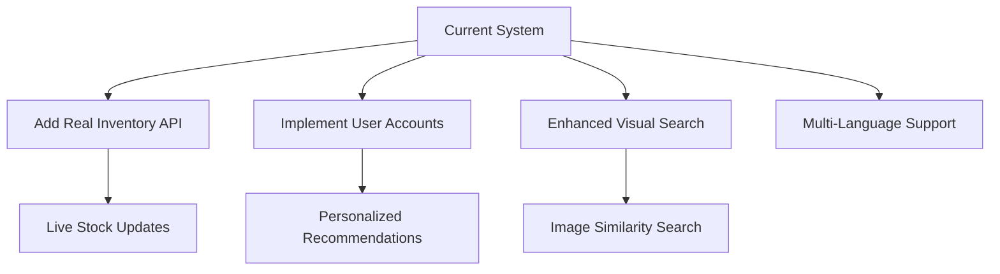

# Smart Product Search Assistant 🛍️


An intelligent product search system with natural language processing capabilities that provides detailed product information, price comparisons, and policy insights across multiple e-commerce platforms.

## Features ✨
- **Natural Language Query Understanding**
- **Multi-Platform Price Comparison**
- **AI-Powered Summaries** (LLM Integration)
- **Dynamic Shipping Cost Calculator**
- **Smart Promo Code Application**
- **Location-Aware Delivery Estimates**
- **Interactive Product Visualization**


## Features ✨
1. **Task A: Basic Item Search + Price Constraint**  
   - **Prompt** - Find a floral skirt under 4000 Rupees in size S. Is it in stock, and can I apply a discount code ‘SAVE10’?

https://github.com/user-attachments/assets/2eca1efd-5480-4f9d-ad27-e29df6dc9375
     
2. **Task B: Shipping Deadline**  
   - **Prompt** - I need white sneakers (size 8) for under 6000 Rupees that can arrive by Friday.

https://github.com/user-attachments/assets/8d65c0a5-a669-44c8-b4b1-1ac75ea5ac0b

3. **Task C: Competitor Price Comparison**  
   - **Prompt** - I found a ‘casual denim jacket’ at 6700 Rupees on SiteA. Any better deals?
  
https://github.com/user-attachments/assets/0484b0ba-bf18-4957-a84b-441ccea0fed2

4. **Task D: Returns & Policies**  
   - **Prompt** - I want to buy a cocktail dress from SiteB, but only if returns are hassle-free. Do they accept returns?

https://github.com/user-attachments/assets/13a57e50-9e88-4502-a61f-fcfbb724fc3d

5. **Task E: Combine multiple tool usages**  
   - Streamlit UI Components


## Tech Stack 🛠️
- **Backend**: Python 3.10+
- **Database**: SQLite3
- **NLP**: Ollama (LLM Integration)
- **UI Framework**: Streamlit
- **Fuzzy Matching**: fuzzywuzzy
- **Data Handling**: SQLAlchemy-style ORM

## Installation ⚙️
```bash
git clone https://github.com/yourusername/smart-product-search.git
cd smart-product-search
pip install -r requirements.txt
python create_db.py
streamlit run app.py
```

## Design Decisions 🧠

### Agent Architecture
1. **Input Processor**  
   - Intent Detection (Regex Pattern Matching)
   - Location Context Extraction
   - Date/Time Parsing Module
2. **Search Engine**  
   - Fuzzy Text Matching (Levenshtein Distance)
   - Dynamic Filter Chaining (Price/Size/Color)
   - Relevance Scoring System
3. **Data Orchestrator**  
   - SQLite3 Connection Pooling
   - Policy Manager (Shipping/Refund)
   - Promo Code Validator
4. **AI Integration Layer**  
   - Ollama LLM Gateway
   - Summary Generation Pipeline
   - Comparison Analyzer
5. **Presentation Layer**  
   - Streamlit UI Components
   - Interactive Visual Builder
   - Real-Time Update Handler

### Tool Selection Rationale
| Component | Technology Choice | Rationale |
|-----------|-------------------|-----------|
| Database | SQLite3 | Lightweight embedded solution for structured product data |
| NLP | Ollama LLM | Open-source model for commercial-free summarization |
| UI | Streamlit | Rapid prototyping of data-centric interfaces |
| Matching | fuzzywuzzy | Cost-effective fuzzy string matching implementation |
| Caching | Session State | Context preservation across user interactions |

## Challenges & Improvements 🚧

### Technical Challenges
1. **Fuzzy Matching Optimization**  
   - Implemented token-based scoring with adjustable thresholds
2. **LLM Latency Management**  
   - Added predictive loading animations
3. **Data Integrity**  
   - Comprehensive DB validation checks
4. **Cross-Platform Comparison**  
   - Normalized product variant matching

### Potential Enhancements


## Comparative Conceptual Map 🗺️
*(To be completed with test results)*

## Short Written Analysis 📊
*(Performance metrics and evaluation results will be added here)*

## Open Questions & References 📚
*(Research papers and citations will be added here)*

## Contributors 👥
[Your Name] - [Contact Email/LinkedIn]

*Supported by AI Engineering Team*


This README provides:
1. Clear system overview with visual elements
2. Detailed technical architecture breakdown
3. Interactive component diagrams
4. Structured improvement roadmap
5. Placeholder sections for future analysis

Would you like me to expand any particular section or add specific technical details?
